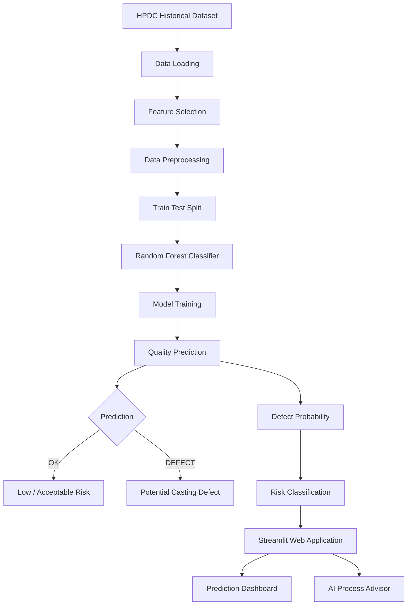
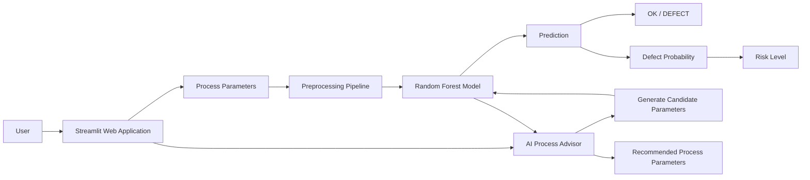
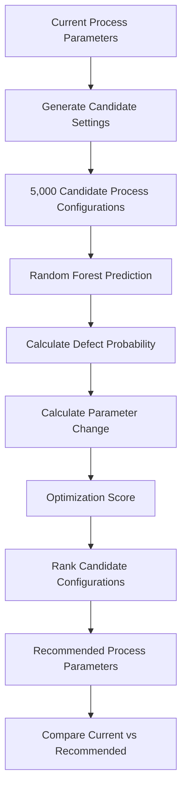
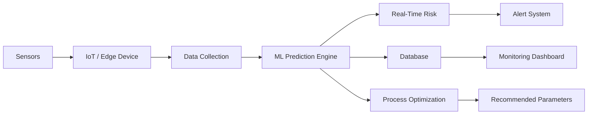

# 🏭 Die Casting AI Process Advisor

An AI-powered **High Pressure Die Casting (HPDC) Quality Prediction and Process Recommendation System** that uses Machine Learning to predict casting quality and assist in selecting lower-risk process parameters.

The project combines a **Random Forest machine-learning model**, process-parameter analysis, and a **Streamlit web application** to provide an interactive interface for die-casting quality prediction and process optimization.

---

## 🚀 Project Overview

High Pressure Die Casting involves multiple process parameters such as melt temperature, die temperature, injection speed, injection pressure, intensification pressure, filling time, cooling time, and vacuum pressure.

Small changes in these parameters can affect the final casting quality.

This project uses historical HPDC process data to:

- Predict whether a casting is likely to be **OK** or **DEFECT**
- Estimate the **defect probability**
- Classify the process into **LOW, MEDIUM, or HIGH risk**
- Explore the historical dataset
- Generate a model-based process recommendation
- Provide an interactive web interface using Streamlit

---

# 🎯 Objectives

The main objectives of the project are:

1. Develop a Machine Learning model for HPDC casting quality prediction.
2. Use important casting process parameters as model inputs.
3. Predict casting quality as **OK** or **DEFECT**.
4. Calculate the probability of a defect.
5. Provide a process-risk classification.
6. Develop a process-advisor module that searches candidate process conditions.
7. Create an easy-to-use Streamlit dashboard for engineers and users.

---

# 🧠 Machine Learning Workflow



---

# ⚙️ System Architecture



---

# 📊 Input Parameters

The model uses the following process parameters:

| Parameter | Description |
|---|---|
| `melt_temp_C` | Melt temperature in °C |
| `die_temp_C` | Die temperature in °C |
| `injection_speed_mps` | Injection speed in m/s |
| `injection_pressure_bar` | Injection pressure in bar |
| `intensification_pressure_bar` | Intensification pressure in bar |
| `filling_time_s` | Filling time in seconds |
| `cooling_time_s` | Cooling time in seconds |
| `vacuum_pressure_bar` | Vacuum pressure in bar |
| `alloy_type` | Alloy/material type |

The target variable is:

```text
quality
```

with the classes:

```text
OK
DEFECT
```

---

# 🤖 Machine Learning Model

The project uses a:

## Random Forest Classifier

The model configuration used in the project includes:

```text
Algorithm        : Random Forest Classifier
Number of Trees  : 300
Random State     : 42
Class Weight     : Balanced
Maximum Depth    : None
```

The preprocessing pipeline handles:

- Missing numerical values
- Numerical feature scaling
- Missing categorical values
- Categorical feature encoding

The categorical alloy information is converted using one-hot encoding.

---

# 🔮 Prediction System

The Streamlit prediction module allows the user to enter the current casting parameters.

The model returns:

### Quality Prediction

```text
OK
```

or

```text
DEFECT
```

### Defect Probability

Example:

```text
Defect Probability: 18.42%
```

### Risk Classification

The application categorizes the predicted defect probability into:

```text
LOW
MEDIUM
HIGH
```

This provides a simple interpretation of the ML prediction.

---

# 🤖 AI Process Advisor

The project also contains an **AI Process Advisor**.

Instead of only predicting the current process condition, the advisor attempts to find a better process configuration.

The workflow is:



The advisor generates candidate values within the observed dataset ranges and evaluates them using the trained Random Forest model.

The recommendation considers both:

- Predicted defect probability
- Magnitude of process-parameter changes

This prevents the recommendation from simply selecting an extreme parameter configuration without considering how much the process would need to change.

---

# 🖥️ Streamlit Web Application

The project provides three main modules.

## 1. 🔮 Prediction

Users enter casting process parameters and receive:

- Quality prediction
- Defect probability
- Risk level
- Process warning

---

## 2. 🤖 AI Process Advisor

The advisor provides:

- Current defect probability
- Recommended defect probability
- Predicted risk reduction
- Current process parameters
- Recommended process parameters
- Parameter-by-parameter changes

---

## 3. 📊 Dataset Insights

The dashboard provides:

- Dataset size
- Number of columns
- Observed defect rate
- Quality distribution
- Defect-type distribution
- Dataset preview
- Process-parameter ranges
- Parameter statistics

---

# 📁 Project Structure

```text
Die_Casting_Project/
│
├── HPDC/
│   │
│   ├── HPDC_1000_rows_11_columns_FIXED.csv
│   │
│   ├── Model.ipynb
│   │
│   └── app.py
│
├── requirements.txt
│
└── README.md
```

### Important Files

### `HPDC_1000_rows_11_columns_FIXED.csv`

Historical HPDC dataset used for model development and prediction.

### `Model.ipynb`

Jupyter Notebook containing the Machine Learning workflow and process-advisor development.

### `app.py`

Streamlit application containing:

- Data loading
- Model training
- Prediction
- Risk calculation
- Process recommendation
- Dataset visualization

### `requirements.txt`

Python dependencies required to run the application.

---

# 🛠️ Technologies Used

### Programming Language

- Python

### Machine Learning

- Scikit-learn
- Random Forest
- Pandas
- NumPy

### Data Processing

- Pandas
- NumPy
- Scikit-learn preprocessing

### Web Application

- Streamlit

### Development

- Jupyter Notebook
- Visual Studio Code
- Git
- GitHub

---

# 📦 Installation

Clone the repository:

```bash
git clone https://github.com/Soham007575/Die_Casting_Project.git
```

Move into the project:

```bash
cd Die_Casting_Project
```

Create a virtual environment:

```bash
python -m venv venv
```

Activate it on Windows:

```powershell
venv\Scripts\activate
```

Install dependencies:

```bash
pip install -r requirements.txt
```

---

# ▶️ Run the Application

Navigate to the folder containing `app.py`.

For example:

```powershell
cd HPDC
```

Run:

```powershell
streamlit run app.py
```

The application will normally open at:

```text
http://localhost:8501
```

---

# 🌐 Sharing the Application

For temporary local demonstrations, the application can be exposed using a tunneling service such as ngrok.

Start Streamlit:

```powershell
streamlit run app.py
```

Then in another terminal:

```powershell
ngrok http 8501
```

The generated public URL can then be shared with project teammates.

---

# 🔄 Complete Project Workflow

```text
                 ┌─────────────────────┐
                 │   HPDC Dataset      │
                 │     CSV File        │
                 └──────────┬──────────┘
                            │
                            ▼
                 ┌─────────────────────┐
                 │ Data Preprocessing  │
                 │                     │
                 │ • Imputation        │
                 │ • Scaling           │
                 │ • Encoding          │
                 └──────────┬──────────┘
                            │
                            ▼
                 ┌─────────────────────┐
                 │ Train/Test Split    │
                 └──────────┬──────────┘
                            │
                            ▼
                 ┌─────────────────────┐
                 │ Random Forest       │
                 │ Classifier          │
                 │ 300 Trees           │
                 └──────────┬──────────┘
                            │
               ┌────────────┴────────────┐
               │                         │
               ▼                         ▼
      ┌─────────────────┐       ┌─────────────────┐
      │ Quality         │       │ Defect          │
      │ Prediction      │       │ Probability     │
      └────────┬────────┘       └────────┬────────┘
               │                         │
               └────────────┬────────────┘
                            ▼
                 ┌─────────────────────┐
                 │ Risk Classification │
                 │ LOW / MEDIUM / HIGH │
                 └──────────┬──────────┘
                            │
                            ▼
                 ┌─────────────────────┐
                 │ Streamlit Dashboard │
                 └──────────┬──────────┘
                            │
                 ┌──────────┴──────────┐
                 │                     │
                 ▼                     ▼
          Prediction             Process Advisor
                                      │
                                      ▼
                              5,000 Candidates
                                      │
                                      ▼
                              Model Evaluation
                                      │
                                      ▼
                              Recommended Setup
```

---

# 📈 Advantages

- Interactive web-based interface
- Machine-learning-based quality prediction
- Defect probability estimation
- Risk classification
- Process parameter comparison
- Automated candidate evaluation
- Historical dataset analysis
- Easy local deployment using Streamlit
- Suitable for further integration with real-time casting-machine data

---

# 🔮 Future Scope

The current project can be extended into a real industrial monitoring system.

### Possible future improvements

- Connect directly to casting-machine sensors
- Real-time temperature acquisition
- Real-time pressure monitoring
- Injection-speed monitoring
- IoT-based machine connectivity
- Real-time defect prediction
- Production-line dashboard
- Model monitoring and retraining
- Database integration
- Cloud deployment
- Alert system for high-risk conditions
- Integration with PLC/SCADA systems
- Computer vision for surface-defect detection

### Future Industrial Architecture



---

# ⚠️ Important Note

This system is a **machine-learning decision-support prototype**.

Model predictions and process recommendations should be validated by qualified process engineers before being applied to an actual production die-casting machine.

The recommendation system should not directly control industrial equipment without appropriate industrial safety systems, validation, and control logic.

---

# 👨‍💻 Author

**Soham Antre**

Computer Engineering Student

GitHub:  
https://github.com/Soham007575

---

# ⭐ Project

If you find this project useful, consider giving the repository a ⭐ on GitHub.

**Repository:**  
https://github.com/Soham007575/Die_Casting_Project

---

## 📌 Keywords

```text
Die Casting
High Pressure Die Casting
HPDC
Machine Learning
Random Forest
Quality Prediction
Defect Prediction
Process Optimization
Process Advisor
Artificial Intelligence
Python
Scikit-learn
Streamlit
Manufacturing AI
Smart Manufacturing
Industry 4.0
```
